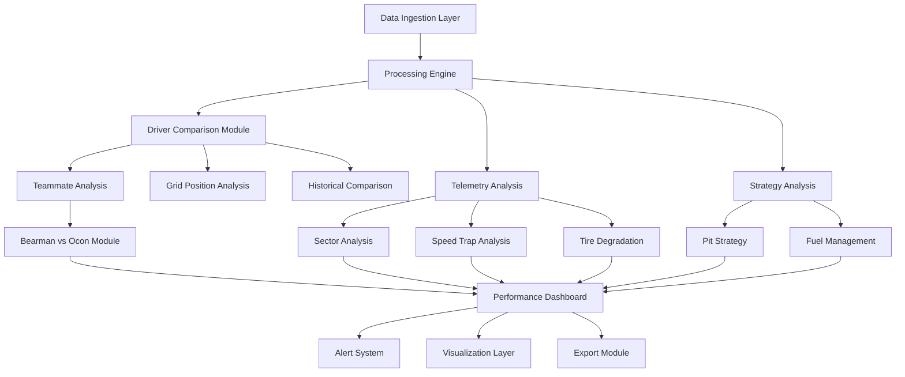
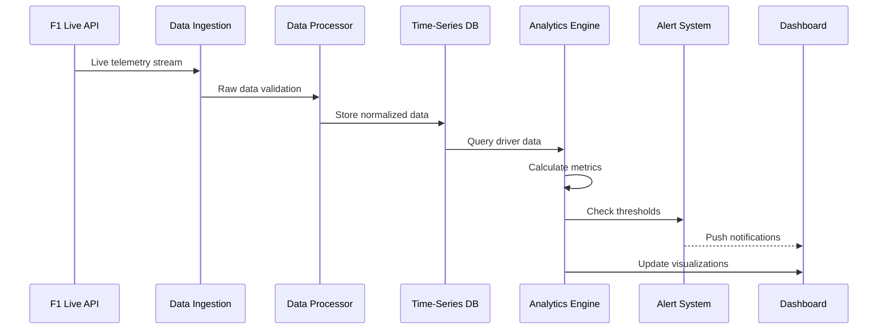
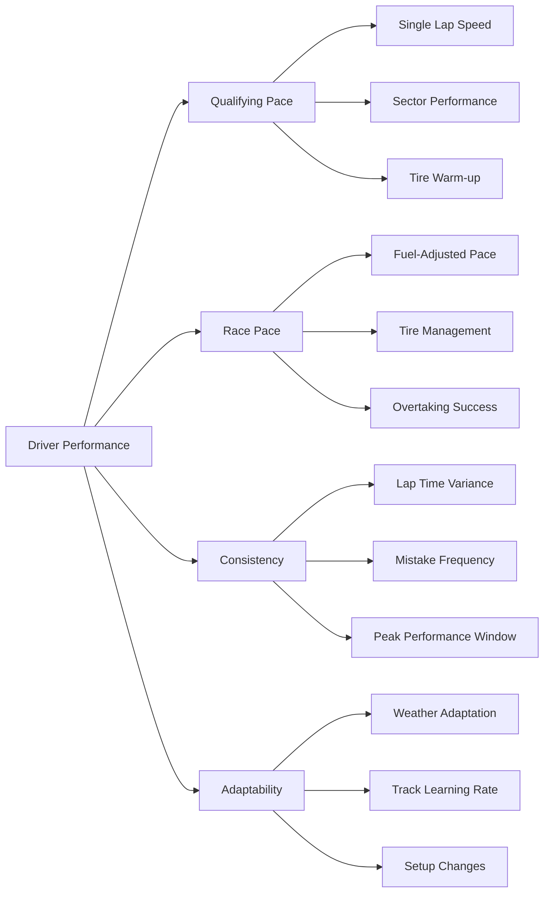
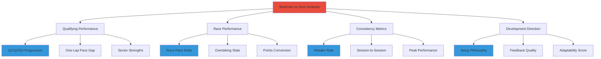
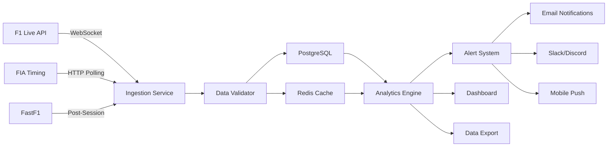

# 🏎️ F1 Data Command Center

[](https://www.formula1.com)
[](https://github.com/pvtaj3/f1-data-command-center)
[](https://github.com/pvtaj3/f1-data-command-center)

**Advanced F1 telemetry analysis and driver performance comparison platform for the 2026 FIA Formula One World Championship.**

## 📋 Overview

The F1 Data Command Center is a comprehensive analytics platform designed to provide deep insights into driver performance, race strategy, and car telemetry. With a primary focus on **teammate comparisons** and **performance benchmarking**, this system delivers actionable intelligence for the 2026 F1 season.

### 🎯 Primary Objectives

- **Real-time telemetry analysis** across all sessions (FP1, FP2, FP3, Qualifying, Race)
- **Driver performance comparison framework** with multi-dimensional metrics
- **Bearman vs Ocon deep-dive analysis** (Haas F1 Team)
- **Predictive modeling** for race outcomes and strategy optimization
- **Automated alerts** for performance thresholds and anomalies
- **Historical trend analysis** across the 2026 season

### 📅 2026 Season Focus

**Season Opener:** Australian Grand Prix  
📍 Albert Park Circuit, Melbourne  
📆 March 6-8, 2026

---

## 🏗️ Driver Comparison Framework

### Architecture Overview



### Data Flow Pipeline



### Performance Comparison Matrix



---

## 📊 Technical Data Structures

### 1. Sector Times Analysis

```json
{
  "session_id": "2026-R01-AUS-Q",
  "driver_number": 87,
  "driver_name": "Ollie Bearman",
  "team": "Haas F1 Team",
  "lap_number": 12,
  "timestamp": "2026-03-08T14:23:45.123Z",
  "sectors": {
    "sector_1": {
      "time_ms": 23456,
      "speed_trap_kmh": 312.4,
      "throttle_percentage": 87.3,
      "brake_points": [
        {"position_m": 145, "pressure_bar": 98.2, "duration_ms": 1234}
      ],
      "delta_to_teammate_ms": -87,
      "delta_to_fastest_ms": 143,
      "gear_changes": 8,
      "drs_usage_ms": 4500
    },
    "sector_2": {
      "time_ms": 34567,
      "speed_trap_kmh": 287.6,
      "throttle_percentage": 76.8,
      "brake_points": [
        {"position_m": 234, "pressure_bar": 102.4, "duration_ms": 987}
      ],
      "delta_to_teammate_ms": 112,
      "delta_to_fastest_ms": 298,
      "gear_changes": 12,
      "cornering_speed_avg_kmh": 156.7
    },
    "sector_3": {
      "time_ms": 28934,
      "speed_trap_kmh": 298.3,
      "throttle_percentage": 82.1,
      "brake_points": [
        {"position_m": 312, "pressure_bar": 95.7, "duration_ms": 1098}
      ],
      "delta_to_teammate_ms": -45,
      "delta_to_fastest_ms": 187,
      "gear_changes": 9
    }
  },
  "total_lap_time_ms": 86957,
  "tire_compound": "C5_SOFT",
  "tire_age_laps": 2,
  "track_temp_celsius": 38.4,
  "air_temp_celsius": 24.7,
  "fuel_load_kg": 110.0
}
```

### 2. Speed Trap Telemetry

```json
{
  "session_id": "2026-R01-AUS-RACE",
  "driver_number": 87,
  "lap_number": 24,
  "speed_traps": [
    {
      "trap_id": "T1_MAIN_STRAIGHT",
      "location_km": 0.234,
      "speed_kmh": 334.7,
      "drs_active": true,
      "slipstream_detected": false,
      "engine_mode": "RACE",
      "ers_deployment_kw": 120.0,
      "delta_to_teammate_kmh": 2.3,
      "percentile_grid": 78.4
    },
    {
      "trap_id": "T2_SECTOR_2",
      "location_km": 2.876,
      "speed_kmh": 287.4,
      "drs_active": false,
      "slipstream_detected": true,
      "engine_mode": "RACE",
      "ers_deployment_kw": 0.0,
      "delta_to_teammate_kmh": -1.8,
      "percentile_grid": 65.2
    }
  ],
  "average_speed_kmh": 198.4,
  "top_speed_kmh": 334.7,
  "speed_consistency_coefficient": 0.92
}
```

### 3. Tire Degradation Model

```json
{
  "session_id": "2026-R01-AUS-RACE",
  "driver_number": 31,
  "driver_name": "Esteban Ocon",
  "stint_number": 2,
  "tire_data": {
    "compound": "C4_MEDIUM",
    "starting_lap": 18,
    "current_lap": 35,
    "tire_age_laps": 17,
    "degradation_profile": [
      {
        "lap": 18,
        "lap_time_ms": 84230,
        "fuel_corrected_ms": 84230,
        "grip_index": 100.0,
        "estimated_remaining_life_laps": 25,
        "surface_temp_avg_c": 96.4
      },
      {
        "lap": 25,
        "lap_time_ms": 84456,
        "fuel_corrected_ms": 84312,
        "grip_index": 97.2,
        "estimated_remaining_life_laps": 18,
        "surface_temp_avg_c": 102.1
      },
      {
        "lap": 35,
        "lap_time_ms": 85123,
        "fuel_corrected_ms": 84876,
        "grip_index": 91.8,
        "estimated_remaining_life_laps": 8,
        "surface_temp_avg_c": 108.7
      }
    ],
    "degradation_rate_ms_per_lap": 38.2,
    "cliff_predicted_lap": 43,
    "delta_to_teammate_degradation_ms": -12.4,
    "tire_management_score": 8.7
  }
}
```

### 4. Fuel-Adjusted Pace Analysis

```json
{
  "session_id": "2026-R01-AUS-RACE",
  "driver_number": 87,
  "race_stint_analysis": {
    "stint_number": 1,
    "laps": [14, 15, 16, 17, 18],
    "fuel_correction": {
      "fuel_effect_ms_per_kg": 0.035,
      "starting_fuel_kg": 110.0,
      "fuel_consumption_kg_per_lap": 1.12,
      "corrections": [
        {
          "lap": 14,
          "raw_lap_time_ms": 84567,
          "fuel_load_kg": 95.2,
          "correction_ms": 532,
          "adjusted_lap_time_ms": 84035,
          "delta_to_teammate_adjusted_ms": -98
        },
        {
          "lap": 15,
          "raw_lap_time_ms": 84623,
          "fuel_load_kg": 94.08,
          "correction_ms": 492,
          "adjusted_lap_time_ms": 84131,
          "delta_to_teammate_adjusted_ms": -45
        }
      ]
    },
    "true_pace_average_ms": 84083,
    "consistency_std_dev_ms": 67,
    "teammate_gap_adjusted_ms": -71.5,
    "grid_position_adjusted": 12.3
  }
}
```

---

## 🔥 Bearman vs Ocon: Haas Teammate Analysis

### 2026 Season Context

**Haas F1 Team Driver Lineup:**
- **#87 Oliver Bearman** - Rookie season (Age: 20)
- **#31 Esteban Ocon** - 8th season (Age: 29)

This marks a critical pairing: experienced veteran vs. highly-rated rookie.

### Analysis Framework



### Key Performance Indicators (KPIs)

| Metric | Bearman Target | Ocon Baseline | Threshold Alert |
|--------|---------------|---------------|-----------------|
| **Qualifying Gap** | < 0.200s | 0.000s | > 0.350s |
| **Race Pace Gap (Fuel-Adj)** | < 0.150s/lap | 0.000s/lap | > 0.250s/lap |
| **Points per Race** | 0.5+ | 2.0+ | < 0.3 (Bearman) |
| **Consistency (Std Dev)** | < 0.120s | < 0.080s | > 0.200s |
| **Mistake Frequency** | < 2/weekend | < 1/weekend | > 3/weekend |
| **Tire Management Score** | 7.5+ / 10 | 8.5+ / 10 | < 6.5 |
| **Overtaking Success Rate** | > 65% | > 75% | < 50% |

### Comparative Analysis Dashboard Queries

```python
# Query structure for teammate comparison
TEAMMATE_COMPARISON_QUERY = {
    "drivers": [87, 31],  # Bearman, Ocon
    "session_types": ["Q", "R"],
    "metrics": [
        "sector_times",
        "speed_traps",
        "tire_degradation",
        "fuel_adjusted_pace",
        "consistency_variance",
        "race_craft_score"
    ],
    "aggregation": "per_session",
    "baseline_driver": 31,  # Ocon as baseline
    "alert_thresholds": {
        "qualifying_gap_ms": 350,
        "race_pace_gap_ms": 250,
        "consistency_threshold": 0.200
    }
}
```

### Expected Performance Trajectory

**Australian GP (Round 1):**
- Expected qualifying gap: 0.250-0.400s (Ocon advantage)
- Race pace gap: 0.180-0.300s/lap
- Learning curve emphasis on Bearman

**Mid-Season (Round 10-12):**
- Expected qualifying gap: 0.100-0.250s
- Race pace gap: 0.080-0.180s/lap
- Consistency improvements

**End of Season (Round 22-24):**
- Target qualifying gap: 0.050-0.150s
- Target race pace gap: 0.030-0.100s/lap
- Peak performance windows

---

## 📁 Repository Structure

```
f1-data-command-center/
│
├── data/
│   ├── raw/                          # Raw telemetry data
│   │   ├── 2026-R01-AUS/
│   │   ├── 2026-R02-CHN/
│   │   └── ...
│   ├── processed/                    # Cleaned and normalized data
│   └── historical/                   # Historical comparison datasets
│
├── src/
│   ├── ingestion/
│   │   ├── live_telemetry.py        # Real-time data ingestion
│   │   ├── f1_api_client.py         # F1 API wrapper
│   │   └── data_validator.py        # Data quality checks
│   │
│   ├── processing/
│   │   ├── sector_analyzer.py       # Sector time analysis
│   │   ├── speed_trap_processor.py  # Speed trap data processing
│   │   ├── tire_degradation.py      # Tire degradation modeling
│   │   └── fuel_correction.py       # Fuel-adjusted pace calculations
│   │
│   ├── analytics/
│   │   ├── driver_comparison.py     # Driver comparison framework
│   │   ├── bearman_ocon_module.py   # Dedicated Haas analysis
│   │   ├── performance_metrics.py   # KPI calculations
│   │   └── predictive_models.py     # ML models for predictions
│   │
│   ├── alerts/
│   │   ├── threshold_monitor.py     # Performance threshold alerts
│   │   ├── notification_service.py  # Alert delivery system
│   │   └── alert_rules.yaml         # Configurable alert rules
│   │
│   └── visualization/
│       ├── dashboard.py              # Main dashboard application
│       ├── comparative_plots.py      # Driver comparison visualizations
│       └── telemetry_viewer.py       # Real-time telemetry display
│
├── notebooks/
│   ├── exploratory_analysis/
│   ├── race_reviews/
│   └── bearman_ocon_deep_dive/
│
├── config/
│   ├── data_sources.yaml            # API endpoints and credentials
│   ├── alert_thresholds.yaml        # Performance alert configuration
│   └── driver_database.yaml         # Driver information
│
├── tests/
│   ├── unit/
│   ├── integration/
│   └── test_data/
│
├── docs/
│   ├── api_documentation.md
│   ├── data_dictionary.md
│   └── analysis_methodology.md
│
├── scripts/
│   ├── setup_environment.sh
│   ├── run_live_session.sh
│   └── generate_race_report.sh
│
├── requirements.txt
├── docker-compose.yml
├── .env.example
└── README.md
```

---

## 🚀 Setup Instructions

### Prerequisites

- Python 3.11+
- Docker & Docker Compose
- PostgreSQL 15+ (for time-series data)
- Redis (for caching and real-time updates)
- Node.js 18+ (for dashboard frontend)

### Installation

1. **Clone the repository**
```bash
git clone https://github.com/pvtaj3/f1-data-command-center.git
cd f1-data-command-center
```

2. **Set up Python environment**
```bash
python -m venv venv
source venv/bin/activate  # On Windows: venv\Scripts\activate
pip install -r requirements.txt
```

3. **Configure environment variables**
```bash
cp .env.example .env
# Edit .env with your API keys and configuration
```

4. **Initialize database**
```bash
docker-compose up -d postgres redis
python scripts/init_database.py
```

5. **Run data ingestion service**
```bash
python src/ingestion/live_telemetry.py --session 2026-R01-AUS-FP1
```

6. **Launch dashboard**
```bash
python src/visualization/dashboard.py
# Access at http://localhost:8050
```

### Quick Start for Race Weekend

```bash
# Automated race weekend setup
./scripts/run_live_session.sh --race AUS --year 2026

# This will:
# - Start data ingestion services
# - Initialize real-time monitoring
# - Launch dashboard
# - Activate alert system
```

---

## 📡 Data Sources & Automation

### Primary Data Sources

| Source | Type | Update Frequency | Coverage |
|--------|------|------------------|----------|
| **F1 Live Timing API** | Official | Real-time (< 1s) | All sessions |
| **FIA Timing Data** | Official | Real-time | Race control data |
| **FastF1 Library** | Community | Post-session | Historical telemetry |
| **Ergast API** | Community | Post-race | Results & standings |
| **OpenF1 API** | Community | Real-time | Position tracking |

### Automated Data Pipeline



### Automation Schedule

**Pre-Session (T-30 minutes):**
- Initialize data ingestion pipeline
- Validate API connections
- Load historical baseline data
- Activate alert monitoring

**During Session:**
- Real-time telemetry ingestion (< 1s latency)
- Live performance calculations
- Threshold monitoring and alerts
- Dashboard updates (refresh rate: 2s)

**Post-Session (T+15 minutes):**
- Complete data validation
- Generate session reports
- Update historical database
- Comparative analysis (Bearman vs Ocon)

**Daily:**
- Aggregate session statistics
- Update season trends
- Predictive model retraining
- Data backup and archival

---

## 🔔 Notification System for Performance Thresholds

### Alert Configuration

```yaml
# alert_thresholds.yaml

drivers:
  bearman:
    number: 87
    baseline_driver: 31  # Ocon
    
alerts:
  qualifying:
    - metric: gap_to_teammate
      threshold: 0.350
      severity: WARNING
      message: "Bearman qualifying gap > 0.350s to Ocon"
      
    - metric: gap_to_teammate
      threshold: 0.500
      severity: CRITICAL
      message: "Bearman qualifying gap > 0.500s to Ocon - Investigation required"
      
    - metric: q1_elimination
      condition: eliminated
      severity: HIGH
      message: "Bearman eliminated in Q1"
  
  race:
    - metric: fuel_adjusted_pace_gap
      threshold: 0.250
      severity: WARNING
      message: "Bearman race pace > 0.250s/lap slower than Ocon"
      
    - metric: tire_degradation_delta
      threshold: 0.100
      severity: HIGH
      message: "Bearman tire degradation significantly worse than Ocon"
      
    - metric: mistake_count
      threshold: 2
      severity: HIGH
      message: "Bearman mistake count exceeded threshold"
      
    - metric: position_loss
      threshold: 3
      severity: WARNING
      message: "Bearman lost 3+ positions during race"
  
  consistency:
    - metric: lap_time_std_dev
      threshold: 0.200
      severity: MEDIUM
      message: "Bearman consistency below target (high variance)"
      
  positive_alerts:
    - metric: gap_to_teammate
      threshold: -0.050
      severity: INFO
      message: "🎉 Bearman outqualified Ocon!"
      
    - metric: race_pace_advantage
      threshold: -0.100
      severity: INFO
      message: "🔥 Bearman showing superior race pace to Ocon"

notification_channels:
  - email: aaron@example.com
  - slack: "#f1-alerts"
  - discord: "F1-Data-Center"
  - sms: "+61XXXXXXXXX"  # For CRITICAL alerts only
```

### Alert Delivery System

**Real-time Monitoring:**
- Dashboard notifications (in-app)
- Browser push notifications
- Email alerts (configurable frequency)
- Slack/Discord webhooks
- SMS for critical thresholds

**Alert Intelligence:**
- Contextual alerts (considers track conditions, session type)
- Smart throttling (prevents alert spam)
- Historical comparison (trend-based alerts)
- Predictive alerts (warns before threshold breach)

**Example Alert Flow:**

```python
# Pseudo-code for alert system
def monitor_bearman_ocon_performance(session_data):
    """
    Real-time monitoring of Bearman vs Ocon performance
    """
    qualifying_gap = calculate_qualifying_gap(
        driver_1=87,  # Bearman
        driver_2=31   # Ocon
    )
    
    if qualifying_gap > 0.350:
        send_alert(
            severity="WARNING",
            message=f"Bearman {qualifying_gap:.3f}s behind Ocon in qualifying",
            recipients=["email", "slack"],
            context={
                "session": session_data.session_name,
                "sector_breakdown": get_sector_analysis(),
                "historical_comparison": get_historical_gaps(),
                "recommendations": generate_setup_suggestions()
            }
        )
    
    elif qualifying_gap < -0.050:
        send_alert(
            severity="INFO",
            message=f"🎉 Bearman outqualified Ocon by {abs(qualifying_gap):.3f}s!",
            recipients=["email", "slack"],
            celebrate=True
        )
```

### Alert Dashboard

**Live Alert Monitor:**
- Current session alerts (real-time)
- Alert history (last 24 hours)
- Performance trend indicators
- Threshold proximity warnings
- Custom alert configuration UI

---

## 📈 Analytics Capabilities

### Core Modules

1. **Driver Comparison Engine**
   - Multi-dimensional performance analysis
   - Statistical significance testing
   - Trend identification and forecasting

2. **Telemetry Deep Dive**
   - Corner-by-corner analysis
   - Throttle/brake trace comparison
   - Gear shift optimization
   - Energy deployment strategies

3. **Strategy Simulation**
   - Pit stop window optimization
   - Tire compound selection
   - Fuel saving scenarios
   - Safety car impact modeling

4. **Predictive Analytics**
   - Qualifying position prediction
   - Race result forecasting
   - DNF risk assessment
   - Championship trajectory modeling

### Machine Learning Models

- **XGBoost** - Qualifying performance prediction
- **LSTM Networks** - Tire degradation forecasting
- **Random Forest** - Race result classification
- **Prophet** - Seasonal performance trends

---

## 🎯 2026 Season Goals

### Bearman Development Tracking

**Phase 1: Adaptation (Rounds 1-8)**
- Track learning across different circuit types
- Qualifying improvement trajectory
- Race craft development

**Phase 2: Consistency (Rounds 9-16)**
- Reduce performance variance
- Minimize mistakes
- Points-scoring regularity

**Phase 3: Mastery (Rounds 17-24)**
- Match or exceed teammate pace
- Setup leadership
- Championship contribution

### Season-Long KPIs

- **Bearman vs Ocon qualifying battle:** Track head-to-head record
- **Points contribution:** Monitor points scored vs. team expectations
- **Performance convergence:** Measure gap reduction over season
- **Consistency improvement:** Track lap time variance trends
- **Rookie of the Year campaign:** Benchmark against other rookies

---

## 🤝 Contributing

This is a personal analytics project, but suggestions and improvements are welcome!

### Development Roadmap

- [ ] Complete data ingestion pipeline (Target: March 1, 2026)
- [ ] Real-time dashboard deployment (Target: March 5, 2026)
- [ ] Bearman vs Ocon analysis module (Target: March 6, 2026)
- [ ] Alert system activation (Target: March 6, 2026)
- [ ] Machine learning model training (Target: Post-Round 3)
- [ ] Predictive analytics integration (Target: Post-Round 5)
- [ ] Mobile app development (Target: Mid-season)

---

## 📄 License

This project is licensed under the MIT License - see the LICENSE file for details.

---

## 📞 Contact & Support

**Repository Owner:** Aaron Tindall  
**Project Focus:** F1 2026 Season Data Analytics  
**Primary Analysis:** Bearman vs Ocon (Haas F1 Team)

---

## 🏁 Acknowledgments

- F1 for official timing data
- FastF1 community project
- OpenF1 API contributors
- Ergast Developer API
- Haas F1 Team for an exciting rookie-veteran pairing!

---

**Last Updated:** February 25, 2026  
**Next Race:** Australian GP, March 6-8, 2026  
**Days Until Lights Out:** 9 days 🏎️

---

*"Data is the new fuel. Let's see who manages it better: the rookie or the veteran."* 🔥