# 🏎️ F1 Data Command Center

[](https://www.formula1.com)
[](#)
[](#)

**Advanced F1 telemetry analysis and driver performance comparison platform for the 2026 FIA Formula One World Championship.**

## 📋 Overview

The F1 Data Command Center is a comprehensive analytics platform designed to provide deep insights into driver performance, race strategy, and car telemetry. With a primary focus on **teammate comparisons** and **performance benchmarking**, this system delivers actionable intelligence for the 2026 F1 season.

### 🎯 Primary Objectives

- **Real-time telemetry analysis** across all sessions (FP1, FP2, FP3, Qualifying, Race)
- **Driver performance comparison framework** with multi-dimensional metrics
- **Bearman vs Ocon deep-dive analysis** (Haas F1 Team)
- **Predictive modeling** for race outcomes and strategy optimization
- **Automated alerts** for performance thresholds and anomalies
- **Historical trend analysis** across the 2026 season

### 📅 2026 Season Focus

**Season Opener:** Australian Grand Prix  
📍 Albert Park Circuit, Melbourne  
📆 March 6-8, 2026

---

## 🏁 **PRE-SEASON TESTING: BAHRAIN 2026**

### Real Performance Data Analysis

**Haas F1 Team - Bahrain International Circuit Pre-Season Testing**

---

## 📊 **REAL DATA: Lap Time Comparison**

### Best Lap Times - Bearman vs Ocon


**📈 Performance Summary:**
- ✅ **Bearman: 95.778s** (Day 1 Best)
- ⚠️ **Ocon: 96.418s** (Day 2 Best)
- 🎯 **Delta: +0.640s advantage to Bearman**

---

## 🚀 **REAL DATA: Top Speed Comparison**

### Speed Trap Analysis - Maximum Velocity


**Speed Analysis:**
- 🔥 **Bearman: 328 km/h** - Higher top speed
- 📊 **Ocon: 326 km/h** 
- ⚡ **+2 km/h advantage** to Bearman (potential setup/DRS difference)

---

## ⏱️ **REAL DATA: Sector Time Breakdown**

### Detailed Sector Analysis - Bearman vs Ocon

```mermaid
%%{init: {'theme':'dark'}}%%
graph TD
    subgraph "Sector 1: Technical Section"
        S1B["Bearman: <b>30.010s</b>"]
        S1O["Ocon: <b>30.420s</b>"]
        S1D["Delta: <b>-0.410s</b><br/>✅ Bearman faster"]
    end
    
    subgraph "Sector 2: Middle Complex"
        S2B["Bearman: <b>41.992s</b>"]
        S2O["Ocon: <b>42.246s</b>"]
        S2D["Delta: <b>-0.254s</b><br/>✅ Bearman faster"]
    end
    
    subgraph "Sector 3: Final Sector"
        S3B["Bearman: <b>23.710s</b>"]
        S3O["Ocon: <b>23.734s</b>"]
        S3D["Delta: <b>-0.024s</b><br/>✅ Bearman faster"]
    end
    
    S1B --> S2B --> S3B
    S1O --> S2O --> S3O
    
    S1B -.-> S1D
    S1O -.-> S1D
    S2B -.-> S2D
    S2O -.-> S2D
    S3B -.-> S3D
    S3O -.-> S3D
    
    style S1B fill:#00ff00,stroke:#fff,stroke-width:3px,color:#000
    style S1O fill:#ff6b6b,stroke:#fff,stroke-width:2px,color:#000
    style S1D fill:#ffd700,stroke:#fff,stroke-width:2px,color:#000
    
    style S2B fill:#00ff00,stroke:#fff,stroke-width:3px,color:#000
    style S2O fill:#ff6b6b,stroke:#fff,stroke-width:2px,color:#000
    style S2D fill:#ffd700,stroke:#fff,stroke-width:2px,color:#000
    
    style S3B fill:#00ff00,stroke:#fff,stroke-width:3px,color:#000
    style S3O fill:#ff6b6b,stroke:#fff,stroke-width:2px,color:#000
    style S3D fill:#90ee90,stroke:#fff,stroke-width:2px,color:#000
```



### 📉 Sector-by-Sector Delta Analysis

| Sector | Bearman Time | Ocon Time | Delta | Winner |
|--------|-------------|-----------|-------|---------|
| **Sector 1** | 30.010s | 30.420s | **-0.410s** | 🟢 Bearman |
| **Sector 2** | 41.992s | 42.246s | **-0.254s** | 🟢 Bearman |
| **Sector 3** | 23.710s | 23.734s | **-0.024s** | 🟢 Bearman |
| **TOTAL** | **95.712s** | **96.400s** | **-0.688s** | 🏆 **Bearman** |

**Key Insights:**
- ✅ Bearman faster in ALL THREE sectors
- 🔥 Biggest advantage in Sector 1 (-0.410s) - technical section
- 💪 Strong Sector 2 advantage (-0.254s) - middle complex
- ⚡ Marginal S3 advantage (-0.024s) - high-speed final sector

---

## 📈 **REAL DATA: Testing Volume & Consistency**

### Lap Count Analysis - Pre-Season Testing


### Testing Workload Distribution


**Volume Analysis:**
- 🔄 **Ocon: 155 laps** - Primary testing driver
- 🆕 **Bearman: 42 laps** - Rookie familiarization
- 📊 **Ratio: 3.7:1** in favor of Ocon
- ⏱️ **Total Distance:**
  - Ocon: ~843 km (155 laps × 5.412 km)
  - Bearman: ~228 km (42 laps × 5.412 km)

**Interpretation:**
- Ocon received primary testing duties as the experienced driver
- Bearman's limited running focused on car familiarization and baseline setup
- Despite **113 fewer laps**, Bearman posted the **faster best lap time** 🔥

---

## 🎯 **REAL DATA: Performance Metrics Summary**

### Comprehensive Bearman vs Ocon Analysis

```mermaid
%%{init: {'theme':'dark'}}%%
graph TB
    A[Bahrain Pre-Season Testing<br/>Performance Summary]
    
    A --> B[Lap Time Performance]
    A --> C[Top Speed]
    A --> D[Sector Performance]
    A --> E[Testing Volume]
    
    B --> B1["✅ Bearman: 95.778s<br/>⚠️ Ocon: 96.418s<br/>Gap: 0.640s"]
    C --> C1["✅ Bearman: 328 km/h<br/>⚠️ Ocon: 326 km/h<br/>Gap: +2 km/h"]
    D --> D1["✅ S1: Bearman -0.410s<br/>✅ S2: Bearman -0.254s<br/>✅ S3: Bearman -0.024s"]
    E --> E1["📊 Ocon: 155 laps<br/>📊 Bearman: 42 laps<br/>Ratio: 3.7:1"]
    
    B1 --> F[Overall Assessment]
    C1 --> F
    D1 --> F
    E1 --> F
    
    F --> G["🏆 BEARMAN:<br/>Faster best lap<br/>Superior in all sectors<br/>Higher top speed<br/><br/>⚠️ Limited mileage"]
    F --> H["📈 OCON:<br/>Extensive testing<br/>Data gathering focus<br/>Reliability runs<br/><br/>⚠️ Slower best time"]
    
    style A fill:#4b0082,stroke:#fff,stroke-width:4px,color:#fff,font-size:16px
    style B1 fill:#00ff00,stroke:#fff,stroke-width:2px,color:#000
    style C1 fill:#00ff00,stroke:#fff,stroke-width:2px,color:#000
    style D1 fill:#00ff00,stroke:#fff,stroke-width:2px,color:#000
    style E1 fill:#ff8c00,stroke:#fff,stroke-width:2px,color:#000
    style F fill:#ffd700,stroke:#fff,stroke-width:3px,color:#000
    style G fill:#00ff00,stroke:#fff,stroke-width:3px,color:#000
    style H fill:#1e90ff,stroke:#fff,stroke-width:2px,color:#fff
```



---

## 🔥 **KEY FINDINGS: Bahrain Testing Analysis**

### 🏆 Oliver Bearman (#87) - The Rookie Sensation

**Strengths Demonstrated:**
- ✅ **Fastest Overall Lap:** 95.778s (0.640s faster than teammate)
- ✅ **Dominant in ALL Sectors:** Faster in S1, S2, and S3
- ✅ **Highest Top Speed:** 328 km/h (+2 km/h advantage)
- ✅ **Immediate Pace:** Fast from limited running (42 laps)
- ✅ **Strongest in Sector 1:** -0.410s advantage (technical precision)

**Context:**
- ⚠️ Only 42 laps completed vs Ocon's 155
- 🎯 Focused on performance runs rather than long-run testing
- 💡 Impressive speed extraction on limited mileage

---

### 📊 Esteban Ocon (#31) - The Team Leader

**Role in Testing:**
- 🔄 **Primary Testing Driver:** 155 laps (78.7% of team total)
- 📈 **Development Focus:** Long-run programs and data gathering
- 🔧 **Setup Development:** Extensive baseline work
- ⏱️ **Best Lap:** 96.418s (Day 2)

**Context:**
- 🎯 Testing duties prioritized over ultimate lap time
- 📊 Gathering data across different compounds and fuel loads
- 🔧 Focus on race simulation and reliability

---

## 📈 **Performance Gap Analysis**

### Detailed Delta Breakdown


**Gap Attribution:**
- 🔴 **64.1% of gap** lost in Sector 1 (technical)
- 🟠 **39.7% of gap** lost in Sector 2 (middle complex)
- 🟢 **3.7% of gap** lost in Sector 3 (high-speed minimal)

---

## 🏗️ System Architecture

### Data Processing Pipeline


### Real-Time Data Flow


---

## 📊 Technical Data Structures

### 1. Sector Times Analysis

```json
{
  "session_id": "2026-BAHRAIN-TEST-DAY1",
  "driver_number": 87,
  "driver_name": "Ollie Bearman",
  "team": "Haas F1 Team",
  "lap_number": 38,
  "timestamp": "2026-02-20T11:45:23.456Z",
  "sectors": {
    "sector_1": {
      "time_ms": 30010,
      "speed_trap_kmh": 312.4,
      "throttle_percentage": 87.3,
      "brake_points": [
        {"position_m": 145, "pressure_bar": 98.2, "duration_ms": 1234}
      ],
      "delta_to_teammate_ms": -410,
      "delta_to_fastest_ms": 0,
      "gear_changes": 8,
      "drs_usage_ms": 4500
    },
    "sector_2": {
      "time_ms": 41992,
      "speed_trap_kmh": 287.6,
      "throttle_percentage": 76.8,
      "brake_points": [
        {"position_m": 234, "pressure_bar": 102.4, "duration_ms": 987}
      ],
      "delta_to_teammate_ms": -254,
      "delta_to_fastest_ms": 0,
      "gear_changes": 12,
      "cornering_speed_avg_kmh": 156.7
    },
    "sector_3": {
      "time_ms": 23710,
      "speed_trap_kmh": 328.0,
      "throttle_percentage": 98.1,
      "brake_points": [
        {"position_m": 312, "pressure_bar": 95.7, "duration_ms": 1098}
      ],
      "delta_to_teammate_ms": -24,
      "delta_to_fastest_ms": 0,
      "gear_changes": 4
    }
  },
  "total_lap_time_ms": 95712,
  "tire_compound": "C3_MEDIUM",
  "tire_age_laps": 8,
  "track_temp_celsius": 32.4,
  "air_temp_celsius": 24.7,
  "fuel_load_kg": 45.0
}
```

### 2. Speed Trap Telemetry

```json
{
  "session_id": "2026-BAHRAIN-TEST-DAY1",
  "driver_number": 87,
  "lap_number": 38,
  "speed_traps": [
    {
      "trap_id": "T1_MAIN_STRAIGHT",
      "location_km": 1.090,
      "speed_kmh": 328.0,
      "drs_active": true,
      "slipstream_detected": false,
      "engine_mode": "QUALIFYING",
      "ers_deployment_kw": 120.0,
      "delta_to_teammate_kmh": 2.0,
      "percentile_grid": 92.4
    },
    {
      "trap_id": "T2_BACK_STRAIGHT",
      "location_km": 3.456,
      "speed_kmh": 312.4,
      "drs_active": true,
      "slipstream_detected": false,
      "engine_mode": "QUALIFYING",
      "ers_deployment_kw": 118.5,
      "delta_to_teammate_kmh": 1.8,
      "percentile_grid": 88.2
    }
  ],
  "average_speed_kmh": 203.4,
  "top_speed_kmh": 328.0,
  "speed_consistency_coefficient": 0.94
}
```

### 3. Tire Degradation Model

```json
{
  "session_id": "2026-BAHRAIN-TEST-DAY2",
  "driver_number": 31,
  "driver_name": "Esteban Ocon",
  "stint_number": 3,
  "tire_data": {
    "compound": "C4_MEDIUM",
    "starting_lap": 45,
    "current_lap": 62,
    "tire_age_laps": 17,
    "degradation_profile": [
      {
        "lap": 45,
        "lap_time_ms": 96800,
        "fuel_corrected_ms": 96800,
        "grip_index": 100.0,
        "estimated_remaining_life_laps": 28,
        "surface_temp_avg_c": 96.4
      },
      {
        "lap": 54,
        "lap_time_ms": 97100,
        "fuel_corrected_ms": 96950,
        "grip_index": 97.8,
        "estimated_remaining_life_laps": 19,
        "surface_temp_avg_c": 101.2
      },
      {
        "lap": 62,
        "lap_time_ms": 97560,
        "fuel_corrected_ms": 97200,
        "grip_index": 94.2,
        "estimated_remaining_life_laps": 11,
        "surface_temp_avg_c": 106.8
      }
    ],
    "degradation_rate_ms_per_lap": 23.5,
    "cliff_predicted_lap": 73,
    "delta_to_teammate_degradation_ms": 8.4,
    "tire_management_score": 8.2
  }
}
```

### 4. Fuel-Adjusted Pace Analysis

```json
{
  "session_id": "2026-BAHRAIN-TEST-DAY2",
  "driver_number": 31,
  "race_stint_analysis": {
    "stint_number": 2,
    "laps": [28, 29, 30, 31, 32],
    "fuel_correction": {
      "fuel_effect_ms_per_kg": 0.038,
      "starting_fuel_kg": 110.0,
      "fuel_consumption_kg_per_lap": 1.15,
      "corrections": [
        {
          "lap": 28,
          "raw_lap_time_ms": 97200,
          "fuel_load_kg": 78.5,
          "correction_ms": 1196,
          "adjusted_lap_time_ms": 96004,
          "delta_to_teammate_adjusted_ms": 226
        },
        {
          "lap": 29,
          "raw_lap_time_ms": 97350,
          "fuel_load_kg": 77.35,
          "correction_ms": 1150,
          "adjusted_lap_time_ms": 96200,
          "delta_to_teammate_adjusted_ms": 422
        }
      ]
    },
    "true_pace_average_ms": 96102,
    "consistency_std_dev_ms": 134,
    "teammate_gap_adjusted_ms": 324,
    "grid_position_adjusted": 14.8
  }
}
```

---

## 🔥 Bearman vs Ocon: Haas Teammate Analysis

### 2026 Season Context

**Haas F1 Team Driver Lineup:**
- **#87 Oliver Bearman** - Rookie season (Age: 20)
- **#31 Esteban Ocon** - 8th season (Age: 29)

This marks a critical pairing: experienced veteran vs. highly-rated rookie.

### Analysis Framework


### Key Performance Indicators (KPIs)

| Metric | Bearman Target | Ocon Baseline | Threshold Alert | **Testing Result** |
|--------|---------------|---------------|-----------------|-------------------|
| **Qualifying Gap** | < 0.200s | 0.000s | > 0.350s | ✅ **-0.640s** (Bearman faster!) |
| **Race Pace Gap (Fuel-Adj)** | < 0.150s/lap | 0.000s/lap | > 0.250s/lap | 🔄 TBD (Limited data) |
| **Top Speed** | Within 2 km/h | Baseline | > 5 km/h deficit | ✅ **+2 km/h** (Bearman faster!) |
| **Consistency (Std Dev)** | < 0.120s | < 0.080s | > 0.200s | 🔄 Insufficient laps |
| **Sector 1 Performance** | < 0.150s | 0.000s | > 0.300s | ✅ **-0.410s** (Bearman faster!) |
| **Sector 2 Performance** | < 0.150s | 0.000s | > 0.300s | ✅ **-0.254s** (Bearman faster!) |
| **Testing Mileage** | 40+ laps | 150+ laps | N/A | ✅ 42 laps / 155 laps |

### Pre-Season Testing Performance Summary

**🏆 OUTSTANDING: Bearman exceeded all expectations**
- ✅ Faster best lap despite 113 fewer laps
- ✅ Dominant across all sectors
- ✅ Higher top speed
- ✅ Immediate pace on limited running

**Assessment:** Bearman's testing performance suggests he may challenge Ocon more closely than anticipated from the season start.

### Expected Performance Trajectory

**Australian GP (Round 1) - REVISED EXPECTATIONS:**
- Expected qualifying gap: 0.100-0.250s (reduced from 0.250-0.400s based on testing)
- Race pace gap: 0.100-0.200s/lap (improved outlook)
- Bearman showed immediate one-lap pace; race consistency TBD

**Mid-Season (Round 10-12):**
- Expected qualifying gap: 0.050-0.150s
- Race pace gap: 0.050-0.120s/lap
- Potential for qualifying parity

**End of Season (Round 22-24):**
- Target: Match or exceed Ocon in qualifying
- Target race pace: Within 0.050s/lap
- Potential rookie championship contention

---

## 📁 Repository Structure

```
f1-data-command-center/
│
├── data/
│   ├── raw/                          # Raw telemetry data
│   │   ├── 2026-BAHRAIN-TEST/
│   │   ├── 2026-R01-AUS/
│   │   ├── 2026-R02-CHN/
│   │   └── ...
│   ├── processed/                    # Cleaned and normalized data
│   └── historical/                   # Historical comparison datasets
│
├── src/
│   ├── ingestion/
│   │   ├── live_telemetry.py        # Real-time data ingestion
│   │   ├── f1_api_client.py         # F1 API wrapper
│   │   └── data_validator.py        # Data quality checks
│   │
│   ├── processing/
│   │   ├── sector_analyzer.py       # Sector time analysis
│   │   ├── speed_trap_processor.py  # Speed trap data processing
│   │   ├── tire_degradation.py      # Tire degradation modeling
│   │   └── fuel_correction.py       # Fuel-adjusted pace calculations
│   │
│   ├── analytics/
│   │   ├── driver_comparison.py     # Driver comparison framework
│   │   ├── bearman_ocon_module.py   # Dedicated Haas analysis
│   │   ├── performance_metrics.py   # KPI calculations
│   │   └── predictive_models.py     # ML models for predictions
│   │
│   ├── alerts/
│   │   ├── threshold_monitor.py     # Performance threshold alerts
│   │   ├── notification_service.py  # Alert delivery system
│   │   └── alert_rules.yaml         # Configurable alert rules
│   │
│   └── visualization/
│       ├── dashboard.py              # Main dashboard application
│       ├── comparative_plots.py      # Driver comparison visualizations
│       └── telemetry_viewer.py       # Real-time telemetry display
│
├── notebooks/
│   ├── exploratory_analysis/
│   ├── race_reviews/
│   ├── testing_analysis/             # NEW: Pre-season testing analysis
│   └── bearman_ocon_deep_dive/
│
├── config/
│   ├── data_sources.yaml            # API endpoints and credentials
│   ├── alert_thresholds.yaml        # Performance alert configuration
│   └── driver_database.yaml         # Driver information
│
├── tests/
│   ├── unit/
│   ├── integration/
│   └── test_data/
│
├── docs/
│   ├── api_documentation.md
│   ├── data_dictionary.md
│   └── analysis_methodology.md
│
├── scripts/
│   ├── setup_environment.sh
│   ├── run_live_session.sh
│   └── generate_race_report.sh
│
├── requirements.txt
├── docker-compose.yml
├── .env.example
└── README.md
```

---

## 🚀 Setup Instructions

### Prerequisites

- Python 3.11+
- Docker & Docker Compose
- PostgreSQL 15+ (for time-series data)
- Redis (for caching and real-time updates)
- Node.js 18+ (for dashboard frontend)

### Installation

1. **Clone the repository**
```bash
git clone https://github.com/pvtaj3/f1-data-command-center.git
cd f1-data-command-center
```

2. **Set up Python environment**
```bash
python -m venv venv
source venv/bin/activate  # On Windows: venv\Scripts\activate
pip install -r requirements.txt
```

3. **Configure environment variables**
```bash
cp .env.example .env
# Edit .env with your API keys and configuration
```

4. **Initialize database**
```bash
docker-compose up -d postgres redis
python scripts/init_database.py
```

5. **Run data ingestion service**
```bash
python src/ingestion/live_telemetry.py --session 2026-R01-AUS-FP1
```

6. **Launch dashboard**
```bash
python src/visualization/dashboard.py
# Access at http://localhost:8050
```

### Quick Start for Race Weekend

```bash
# Automated race weekend setup
./scripts/run_live_session.sh --race AUS --year 2026

# This will:
# - Start data ingestion services
# - Initialize real-time monitoring
# - Launch dashboard
# - Activate alert system
```

---

## 📡 Data Sources & Automation

### Primary Data Sources

| Source | Type | Update Frequency | Coverage |
|--------|------|------------------|----------|
| **F1 Live Timing API** | Official | Real-time (< 1s) | All sessions |
| **FIA Timing Data** | Official | Real-time | Race control data |
| **FastF1 Library** | Community | Post-session | Historical telemetry |
| **Ergast API** | Community | Post-race | Results & standings |
| **OpenF1 API** | Community | Real-time | Position tracking |

### Automated Data Pipeline


### Automation Schedule

**Pre-Session (T-30 minutes):**
- Initialize data ingestion pipeline
- Validate API connections
- Load historical baseline data
- Activate alert monitoring

**During Session:**
- Real-time telemetry ingestion (< 1s latency)
- Live performance calculations
- Threshold monitoring and alerts
- Dashboard updates (refresh rate: 2s)

**Post-Session (T+15 minutes):**
- Complete data validation
- Generate session reports
- Update historical database
- Comparative analysis (Bearman vs Ocon)

**Daily:**
- Aggregate session statistics
- Update season trends
- Predictive model retraining
- Data backup and archival

---

## 🔔 Notification System for Performance Thresholds

### Alert Configuration

```yaml
# alert_thresholds.yaml

drivers:
  bearman:
    number: 87
    baseline_driver: 31  # Ocon
    
alerts:
  qualifying:
    - metric: gap_to_teammate
      threshold: 0.350
      severity: WARNING
      message: "Bearman qualifying gap > 0.350s to Ocon"
      
    - metric: gap_to_teammate
      threshold: 0.500
      severity: CRITICAL
      message: "Bearman qualifying gap > 0.500s to Ocon - Investigation required"
      
    - metric: q1_elimination
      condition: eliminated
      severity: HIGH
      message: "Bearman eliminated in Q1"
  
  race:
    - metric: fuel_adjusted_pace_gap
      threshold: 0.250
      severity: WARNING
      message: "Bearman race pace > 0.250s/lap slower than Ocon"
      
    - metric: tire_degradation_delta
      threshold: 0.100
      severity: HIGH
      message: "Bearman tire degradation significantly worse than Ocon"
      
    - metric: mistake_count
      threshold: 2
      severity: HIGH
      message: "Bearman mistake count exceeded threshold"
      
    - metric: position_loss
      threshold: 3
      severity: WARNING
      message: "Bearman lost 3+ positions during race"
  
  consistency:
    - metric: lap_time_std_dev
      threshold: 0.200
      severity: MEDIUM
      message: "Bearman consistency below target (high variance)"
      
  positive_alerts:
    - metric: gap_to_teammate
      threshold: -0.050
      severity: INFO
      message: "🎉 Bearman outqualified Ocon!"
      
    - metric: race_pace_advantage
      threshold: -0.100
      severity: INFO
      message: "🔥 Bearman showing superior race pace to Ocon"

notification_channels:
  - email: user@example.com
  - slack: "#f1-alerts"
  - discord: "F1-Data-Center"
  - sms: "+00XXXXXXXXX"  # For CRITICAL alerts only
```

### Alert Delivery System

**Real-time Monitoring:**
- Dashboard notifications (in-app)
- Browser push notifications
- Email alerts (configurable frequency)
- Slack/Discord webhooks
- SMS for critical thresholds

**Alert Intelligence:**
- Contextual alerts (considers track conditions, session type)
- Smart throttling (prevents alert spam)
- Historical comparison (trend-based alerts)
- Predictive alerts (warns before threshold breach)

**Example Alert Flow:**

```python
# Pseudo-code for alert system
def monitor_bearman_ocon_performance(session_data):
    """
    Real-time monitoring of Bearman vs Ocon performance
    """
    qualifying_gap = calculate_qualifying_gap(
        driver_1=87,  # Bearman
        driver_2=31   # Ocon
    )
    
    if qualifying_gap > 0.350:
        send_alert(
            severity="WARNING",
            message=f"Bearman {qualifying_gap:.3f}s behind Ocon in qualifying",
            recipients=["email", "slack"],
            context={
                "session": session_data.session_name,
                "sector_breakdown": get_sector_analysis(),
                "historical_comparison": get_historical_gaps(),
                "recommendations": generate_setup_suggestions()
            }
        )
    
    elif qualifying_gap < -0.050:
        send_alert(
            severity="INFO",
            message=f"🎉 Bearman outqualified Ocon by {abs(qualifying_gap):.3f}s!",
            recipients=["email", "slack"],
            celebrate=True
        )
```

### Alert Dashboard

**Live Alert Monitor:**
- Current session alerts (real-time)
- Alert history (last 24 hours)
- Performance trend indicators
- Threshold proximity warnings
- Custom alert configuration UI

---

## 📈 Analytics Capabilities

### Core Modules

1. **Driver Comparison Engine**
   - Multi-dimensional performance analysis
   - Statistical significance testing
   - Trend identification and forecasting

2. **Telemetry Deep Dive**
   - Corner-by-corner analysis
   - Throttle/brake trace comparison
   - Gear shift optimization
   - Energy deployment strategies

3. **Strategy Simulation**
   - Pit stop window optimization
   - Tire compound selection
   - Fuel saving scenarios
   - Safety car impact modeling

4. **Predictive Analytics**
   - Qualifying position prediction
   - Race result forecasting
   - DNF risk assessment
   - Championship trajectory modeling

### Machine Learning Models

- **XGBoost** - Qualifying performance prediction
- **LSTM Networks** - Tire degradation forecasting
- **Random Forest** - Race result classification
- **Prophet** - Seasonal performance trends

---

## 🎯 2026 Season Goals

### Bearman Development Tracking

**Phase 1: Adaptation (Rounds 1-8)**
- Track learning across different circuit types
- Qualifying improvement trajectory
- Race craft development
- **REVISED:** Testing shows immediate one-lap pace ✅

**Phase 2: Consistency (Rounds 9-16)**
- Reduce performance variance
- Minimize mistakes
- Points-scoring regularity
- Build race distance management

**Phase 3: Mastery (Rounds 17-24)**
- Match or exceed teammate pace
- Setup leadership
- Championship contribution
- **POTENTIAL:** Fight for Rookie of the Year

### Season-Long KPIs

- **Bearman vs Ocon qualifying battle:** Track head-to-head record
- **Points contribution:** Monitor points scored vs. team expectations
- **Performance convergence:** Measure gap reduction over season
- **Consistency improvement:** Track lap time variance trends
- **Rookie of the Year campaign:** Benchmark against other rookies

---

## 🤝 Contributing

Suggestions and improvements are welcome through pull requests.

### Development Roadmap

- [x] Analyze pre-season testing data ✅
- [x] Establish Bearman vs Ocon baseline ✅
- [ ] Complete data ingestion pipeline (Target: March 1, 2026)
- [ ] Real-time dashboard deployment (Target: March 5, 2026)
- [ ] Bearman vs Ocon analysis module (Target: March 6, 2026)
- [ ] Alert system activation (Target: March 6, 2026)
- [ ] Machine learning model training (Target: Post-Round 3)
- [ ] Predictive analytics integration (Target: Post-Round 5)
- [ ] Mobile app development (Target: Mid-season)

---

## 📄 License

This project is licensed under the MIT License - see the LICENSE file for details.

---

## 🏁 Acknowledgments

- F1 for official timing data
- FastF1 community project
- OpenF1 API contributors
- Ergast Developer API
- Haas F1 Team for an exciting rookie-veteran pairing!

---

**Last Updated:** February 26, 2026  
**Pre-Season Testing:** ✅ Complete - Bearman showed exceptional pace  
**Next Race:** Australian GP, March 6-8, 2026  
**Days Until Lights Out:** 8 days 🏎️

---

*"Bearman's testing performance: 95.778s vs Ocon's 96.418s. The rookie has announced his arrival."* 🔥